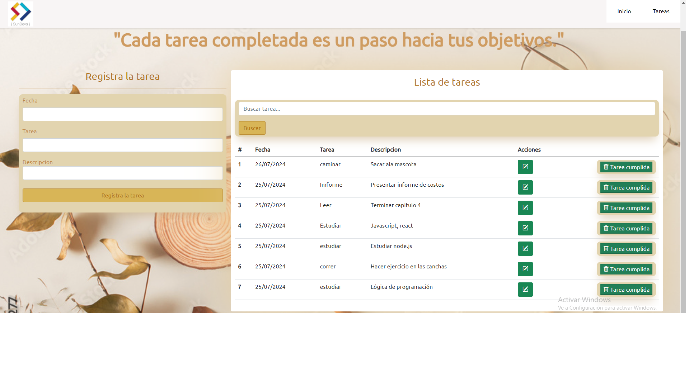

# To-Do List con Node.js, Express y MySQL

Aplicación de lista de tareas (To-Do List) desarrollada con Node.js, utilizando Express para el servidor y `mysql2` para la interacción con la base de datos MySQL.

## Pasos para crear la aplicación

### Paso 1: Configuración inicial

1. Crea un nuevo directorio para tu proyecto:

    ```bash
    mkdir to-do-list
    cd to-do-list
    ```

2. Inicializa un proyecto Node.js:

    ```bash
    npm init -y
    ```

3. Instala las dependencias necesarias: Express, EJS y mysql2:

    ```bash
    npm install express ejs mysql2 cors
    ```

4. Crea un archivo llamado `db.js` en la raíz de tu proyecto para configurar la conexión a la base de datos:

    ```javascript
    import mysql from 'mysql2/promise';

    const pool = mysql.createPool({
        host: 'localhost',
        user: 'root',
        password: '', // Coloca tu contraseña de MySQL
        database: 'CrudNodejs',
        waitForConnections: true,
        connectionLimit: 10,
        queueLimit: 0,
    });

    export default pool;
    ```

### Para correr el proyecto

1. Instala las dependencias:

    ```bash
    npm install
    ```

2. Ejecuta el proyecto:

    ```bash
    node --watch app.js    # Opción 1
    node app.js            # Opción 2
    ```

### Notas

- La propiedad `"type": "module"` en el archivo `package.json` indica que estamos usando el sistema de módulos ECMAScript (ESM). Con esto, las palabras claves `import` y `export` se utilizan para importar y exportar módulos, respectivamente. Algunas características de Node.js, como `require()` y `module.exports`, no están disponibles en ESM.

- Para más información sobre la biblioteca `mysql2`, visita [npm mysql2](https://www.npmjs.com/package/mysql2).

 
